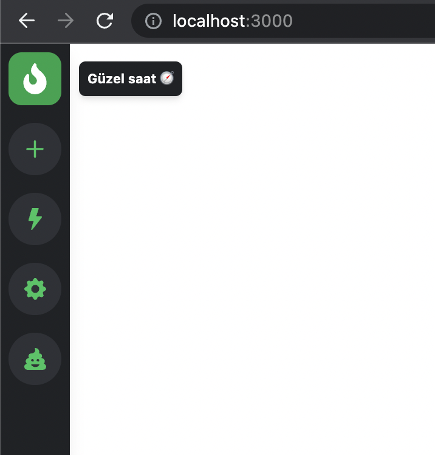

# Ultimate Tailwind CSS Tutorial // Build a Discord-inspired Animated Navbar

[youtube](https://www.youtube.com/watch?v=pfaSUYaSgRo)

`yarn create vite`

`yarn`

`npm install -D tailwindcss postcss autoprefixer`
`npx tailwindcss init -p`

`yarn dev`

`yarn add react-icons`

